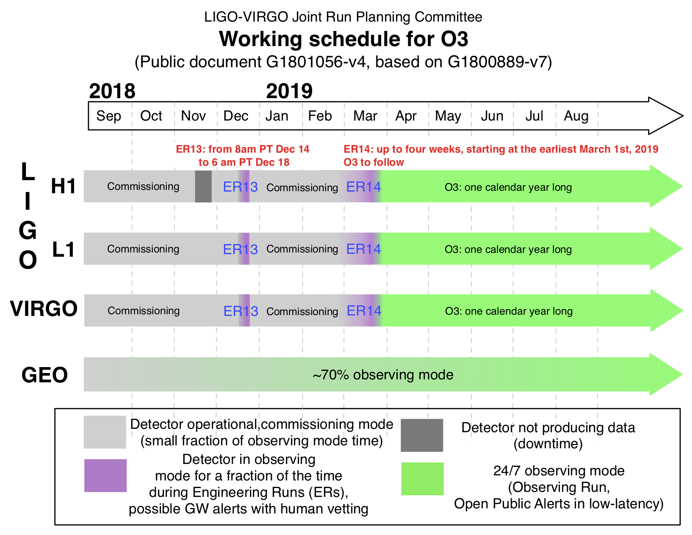

Observing Capabilities
======================

This section summarizes the observing capabilities of the global
gravitational-wave detector network as of late 2018. This as a quick reference
to the anticipated commissioning and observing schedule, sensitivity to
gravitational-wave transients, and sky localization accuracy, as described in
the following external documents:

* White Paper [#WhitePaper]_ on gravitational-wave data analysis and
  astrophysics
* Living Review [#LivingReview]_ on prospects for observing and localizing
  gravitational-wave transients with Advanced LIGO, Advanced Virgo, and KAGRA
* Working Plan Towards O3 [#WorkingPlanTowardsO3]_

Timeline
--------

The gravitational-wave observing schedules is divided into Observing Runs,
epochs of months to years of operation at fixed sensitivity; down time for
construction and commissioning, and transitional Engineering Runs between
commissioning and observing runs. The long-term observing schedule is shown
below.

.. image:: https://media.springernature.com/original/springer-static/image/art%3A10.1007%2Fs41114-018-0012-9/MediaObjects/41114_2018_12_Fig2_HTML.gif
   :alt: Long-term observing schedule

Engineering Run 13 (ER13) is scheduled to start 2018-12-14 16:00 UTC and end
2018-12-18 14:00 UTC. Engineering Run 14 (ER14) is scheduled not before March
2019 for around 4 weeks and will transition without interruption to Observing
Run 3 (O3).

During O3, we expect that all three detectors will observe continuously and
without significant interruptions for one year. It is possible that the
Japanese KAGRA detector may come online and become part of the joint
gravitational-wave analysis at some point during O3. The near-term observing
schedule is shown below, reproduced from [#WorkingPlanTowardsO3]_.

.. important::
   During both Engineering Runs, the detector configuration and analysis
   software will be changing frequently. We will send public alerts only for
   highly confident and scientifically significant events and with longer than
   normal latency. However, at the transition to O3 occurs, we will switch to
   routine low-latency data analysis and sending public alerts for all
   significant gravitational-wave events.

Sensitivity and Localization Accuracy
-------------------------------------

The following O3 projections are adapted from the Living Review
[#LivingReview]_ on prospects for observing and localizing gravitational-wave
transients with Advanced LIGO, Advanced Virgo, and KAGRA. The range (luminosity
distance of detectable sources, averaged over sky position and source
orientation) given the detectors' anticipated sensitivity are listed in the
table below.

+-----------+-------------------+-------------------+
| Detector  | BNS Range (Mpc)   | Burst Range (Mpc) |
+===========+===================+===================+ 
| **LIGO**  | 120–170           | 75–90             |
+-----------+-------------------+-------------------+
| **Virgo** | 65–85             | 40–50             |
+-----------+-------------------+-------------------+
| **Kagra** | 8–25              |                   |
+-----------+-------------------+-------------------+

We expect 1–50 :term:`BNS` events over the course of O3. For BNS events, the
median localization accuracy of in terms of the 90% credible area will be
120–180 deg². 12–21% of BNS mergers will be localized to less than 20 deg².

Event Rates
-----------

See the `rates presentation`_ from recent Town Hall meeting for LIGO and
Virgo's most current estimates of astrophysical rates of compact binary mergers.

.. |LRR| replace:: *Living Rev. Rel.*

.. [#WhitePaper]
   LIGO Scientific Collaboration & Virgo Collaboration 2018, *The LSC-Virgo
   White Paper on Gravitational Wave Data Analysis and Astrophysics*, LIGO
   Document T1800058-v1.
   https://dcc.ligo.org/LIGO-T1800058/public

.. [#LivingReview]
   Abbott, B. P., Abbott, R., Abbott, T. D., et al. 2018, |LRR|, 21, 3.
   https://doi.org/10.1007/s41114-018-0012-9

.. [#WorkingPlanTowardsO3]
   LIGO Scientific Collaboration & Virgo Collaboration 2018, *LIGO-Virgo
   Working Plan Towards O3*, LIGO Document G1801056-v4.
   https://dcc.ligo.org/LIGO-G1801056/public

.. _`rates presentation`: https://wiki.gw-astronomy.org/pub/OpenLVEM/TownHallMeetings2018/O3_rates_amsterdam.pdf
