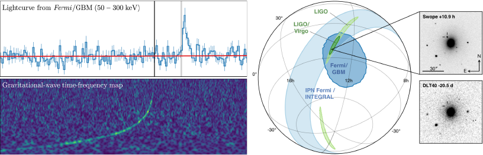

.. LIGO/Virgo Public Alerts User Guide documentation master file, created by
   sphinx-quickstart on Wed Sep 19 09:39:42 2018.
   You can adapt this file completely to your liking, but it should at least
   contain the root `toctree` directive.

LIGO/Virgo Public Alerts User Guide
===================================

Welcome to the LIGO/Virgo Public Alerts User Guide! This document is intended
for both professional astronomers and science enthusiasts who are interested in
receiving alerts and real-time data products related to gravitational-wave (GW)
events.

Three sites (:term:`LHO`, :term:`LLO`, :term:`Virgo`) together form a global
network of ground-based GW detectors. The `LIGO Scientific Collaboration`_ and
the `Virgo Collaboration`_ jointly analyze the data in real time to detect and
localize transients from compact binary mergers and other sources. When a
signal candidate is found, an alert is sent to astronomers in order to search
for counterparts (electromagnetic waves or neutrinos).

`Advanced LIGO`_ and `Advanced Virgo`_ began their third observing run (O3) on
April 1, 2019. For the first time, **LIGO/Virgo alerts are public**. Alerts are
distributed through NASA's Gamma-ray Coordinates Network (:term:`GCN`). There
are two types of alerts: human-readable :term:`GCN Circulars <GCN Circular>`
and machine-readable :term:`GCN Notices <GCN Notice>`. This document provides a
brief overview of the procedures for vetting and sending GW alerts, describes
their contents and format, and includes instructions and sample code for
receiving GCN Notices and decoding GW sky maps.

Contents
--------

.. toctree::
   :maxdepth: 2

   quickstart
   capabilities
   analysis/index
   content
   tutorial/index

Appendix
--------

.. toctree::
   :hidden:

   changes
   glossary

* :doc:`changes`
* :doc:`glossary`
* :ref:`search`
* `Report issues <emfollow-userguide@support.ligo.org>`_

.. _`LIGO Scientific Collaboration`: https://ligo.org/
.. _`Virgo Collaboration`: http://public.virgo-gw.eu/the-virgo-collaboration/
.. _`Advanced LIGO`: https://ligo.caltech.edu
.. _`Advanced Virgo`: http://www.virgo-gw.eu
