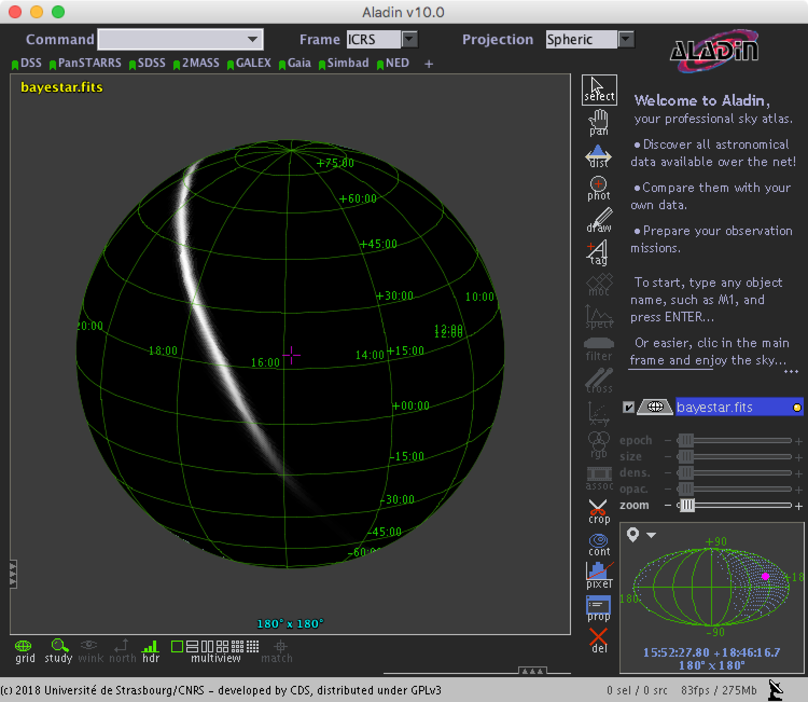
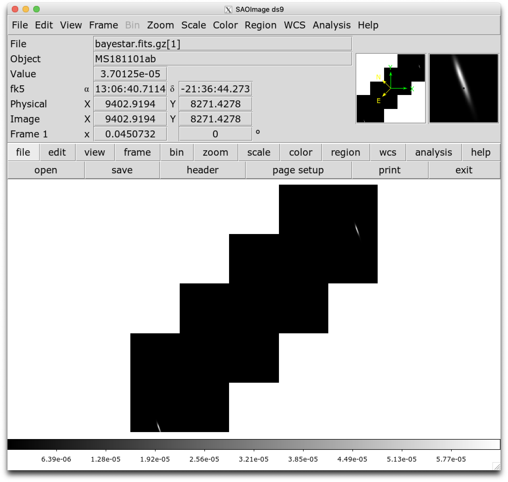

Sample Code
===========

Public LIGO/Virgo alerts are distributed using the Gamma-ray Coordinates
Network (GCN_). The machine-readable alerts are called GCN Notices.

GCN Notices are available over several different protocols and in several
different formats. LIGO/Virgo strongly recommends using the VOEvent Transport
Protocol (VTP_) to receive notices in VOEvent_ XML format because it is
anonymous, configuration-free, and easy to parse.

Prerequisites
-------------

In order to run this sample code, you will need Python >= 3.5 on a Unix-like
operating system (Linux or macOS) and a few third-party Python packages:

  * PyGCN_ for connecting to GCN (alternatives: comet_)
  * healpy_ for decoding HEALPix coordinates (alternatives: astropy-healpix_,
    the official C/C++/Fortran/Java/IDL HEALPix bindings for HEALPix_, DS9_,
    Aladin_)
  * astropy_ for astronomical coordinate transformations, observability, etc.
  * numpy_ and matplotlib_, popular math and plotting packages for Python

If you are on a Mac and use the MacPorts_ package manager, you can install all
of the above with the following command::

    $ sudo port install py37-gcn py37-healpy

Otherwise, the fastest way to install the dependencies is with pip_, a package
manager that comes with most Python distributions. To install these packages
with ``pip``, run the following command::

    $ pip install pygcn healpy

Imports
~~~~~~~

Now we'll write a GCN handler script. First, some imports:

    import gcn
    import gcn.handlers
    import gcn.notice_types
    import healpy as hp
    import numpy as np

Receiving GCNs
--------------

Next, we'll write a GCN handler function that we want PyGCN to call every time
it receives a GCN notice. We :term:`decorate <decorator>` the handler with
``@gcn.handlers.include_notice_types`` to specify that we only want to process
certain GCN notice types (``LVC_PRELIMINARY``, ``LVC_INITIAL``, and
``LVC_UDPATE``).

Events come in two very general flavors: 'CBC' or compact binary coalescence
candidates detected by matched filtering, and generic 'Burst' candidates
detected by model-independent methods. Your handler can take different actions
based on this. The example below will handle only 'CBC' events.

.. important::
   Note that mock or 'test' observations are denoted by the ``role="test"``
   VOEvent attribute. Alerts resulting from real LIGO/Virgo science data will
   always have ``role="observation"``. The sample code below will respond
   **only** to 'test' events. When preparing for actual observations, you
   **must remember to switch to 'observation' events**.

The following basic handler function will parse out the URL of
the FITS file, download it, and extract the probability sky map::

    # Function to call every time a GCN is received.
    # Run only for notices of type
    # LVC_PRELIMINARY, LVC_INITIAL, or LVC_UPDATE.
    @gcn.handlers.include_notice_types(
        gcn.notice_types.LVC_PRELIMINARY,
        gcn.notice_types.LVC_INITIAL,
        gcn.notice_types.LVC_UPDATE)
    def process_gcn(payload, root):
        # Print the alert
        print('Got VOEvent:')
        print(payload)

        # Respond only to 'test' events.
        # VERY IMPORTANT! Replace with the following code
        # to respond to only real 'observation' events.
        # if root.attrib['role'] != 'observation':
        #    return
        if root.attrib['role'] != 'test':
            return

        # Respond only to 'CBC' events. Change 'CBC' to "Burst'
        # to respond to only unmodeled burst events.
        if root.find(".//Param[@name='Group']").attrib['value'] != 'CBC':
            return

        # Read out integer notice type (note: not doing anythin with this right now)
        notice_type = int(root.find(".//Param[@name='Packet_Type']").attrib['value'])

        # Read sky map
        skymap, header = get_skymap(root)

The ``get_skymap`` function will be defined in the next section.

Download the sky map
~~~~~~~~~~~~~~~~~~~~

Now we will define the function ``get_skymap`` get the sky map URL from the
VOEvent, download it, and read it with Healpy.

.. note::
   We do not have to explicitly download the FITS file because the
   :func:`hp.read_map() <healpy.fitsfunc.read_map>` function works with either
   URLs or filenames. However, you could download and save the FITS file in
   order to save it locally using :func:`astropy.utils.data.download_file`,
   :func:`requests.get`, :func:`urllib.request.urlopen`, or even curl_.

::

    def get_skymap(root):
        """
        Look up URL of sky map in VOEvent XML document,
        download sky map, and parse FITS file.
        """
        # Read out URL of sky map.
        # This will be something like
        # https://gracedb.ligo.org/api/events/M131141/files/bayestar.fits.gz
        skymap_url = root.find(
            ".//Param[@name='skymap_fits']").attrib['value']

        # Read the sky map.
        # Note: this works on filenames or URLs.
        # The `h=True` argument instructs Healpy to also return the metadata
        # from the FITS header, and the `verbose=False` argument suppresses
        # printing of some diagnostic information.
        skymap, header = hp.read_map(skymap_url, h=True, verbose=False)

        # Done!
        return skymap, header

Listen for GCNs
~~~~~~~~~~~~~~~

Finally, we will start the VOEvent client to listen for GCNs using the
``gcn.listen`` function. By default, this will connect to the anonymous, public
GCN server. You just need to tell ``gcn.listen`` what function to call whenever
it receives an GCN; in this example, that is the ``process_gcn`` handler that
we defined above.

.. note::
   ``gcn.listen`` will try to automatically reconnect if the network connection
   is ever broken.

::

    # Listen for GCNs until the program is interrupted
    # (killed or interrupted with control-C).
    gcn.listen(handler=process_gcn)

Working with probability sky maps
---------------------------------

Let's take a look at what is inside one of the LIGO/Virgo probability sky maps.
They are FITS image files and can be manipulated and viewed with many
commonplace FITS tools. However, they are a little unusual in two regards.
First, since they are all-sky images, they are stored in the HEALPix
projection, a format that is used for Planck_ all-sky CMB maps and by Aladin
for hierarchical, progressively refined, all-sky survey images (HiPS_)].
Second, the value stored at each pixel is the probability that the
gravitational-wave source is within that pixel.

.. image:: https://healpix.jpl.nasa.gov/images/healpixGridRefinement.jpg
   :alt: HEALPix projection

Let's download an example FITS file with curl_::

    $ curl -O https://emfollow.docs.ligo.org/userguide/_static/bayestar.fits.gz

We can look at the metadata inside the FITS file by printing its header with
tools like funhead_ from Funtools_, imhead_ from WCSTools_, or
:mod:`~astropy.io.fits.scripts.fitsheader` from astropy_::

    $ fitsheader bayestar.fits.gz
    # HDU 0 in bayestar.fits.gz:
    SIMPLE  =                    T / conforms to FITS standard
    BITPIX  =                    8 / array data type
    NAXIS   =                    0 / number of array dimensions
    EXTEND  =                    T

    # HDU 1 in bayestar.fits.gz:
    XTENSION= 'BINTABLE'           / binary table extension
    BITPIX  =                    8 / array data type
    NAXIS   =                    2 / number of array dimensions
    NAXIS1  =                   32 / length of dimension 1
    NAXIS2  =               786432 / length of dimension 2
    PCOUNT  =                    0 / number of group parameters
    GCOUNT  =                    1 / number of groups
    TFIELDS =                    4 / number of table fields
    TTYPE1  = 'PROB    '
    TFORM1  = 'D       '
    TUNIT1  = 'pix-1   '
    TTYPE2  = 'DISTMU  '
    TFORM2  = 'D       '
    TUNIT2  = 'Mpc     '
    TTYPE3  = 'DISTSIGMA'
    TFORM3  = 'D       '
    TUNIT3  = 'Mpc     '
    TTYPE4  = 'DISTNORM'
    TFORM4  = 'D       '
    TUNIT4  = 'Mpc-2   '
    PIXTYPE = 'HEALPIX '           / HEALPIX pixelisation
    ORDERING= 'NESTED  '           / Pixel ordering scheme: RING, NESTED, or NUNIQ
    COORDSYS= 'C       '           / Ecliptic, Galactic or Celestial (equatorial)
    NSIDE   =                  256 / Resolution parameter of HEALPIX
    INDXSCHM= 'IMPLICIT'           / Indexing: IMPLICIT or EXPLICIT
    OBJECT  = 'M2052   '           / Unique identifier for this event
    REFERENC= 'https://gracedb-playground.ligo.org/events/M2052' / URL of this event
    INSTRUME= 'H1,L1   '           / Instruments that triggered this event
    DATE-OBS= '2018-11-01T22:22:46.654438' / UTC date of the observation
    MJD-OBS =    58423.93248442614 / modified Julian date of the observation
    DATE    = '2018-11-01T22:34:37.000000' / UTC date of file creation
    CREATOR = 'BAYESTAR'           / Program that created this file
    ORIGIN  = 'LIGO/Virgo'         / Organization responsible for this FITS file
    RUNTIME =                 11.0 / Runtime in seconds of the CREATOR program
    DISTMEAN=    141.1453950128411 / Posterior mean distance (Mpc)
    DISTSTD =    39.09548411497191 / Posterior standard deviation of distance (Mpc)
    LOGBCI  =    7.793862946657789 / Log Bayes factor: coherent vs. incoherent
    LOGBSN  =    47.28194676827084 / Log Bayes factor: signal vs. noise
    VCSVERS = 'ligo.skymap 0.0.17' / Software version
    VCSREV  = 'cb59e5fd04d41c5181ae9e41fe59de232877ddd2' / Software revision (Git)
    DATE-BLD= '2018-10-24T20:50:55' / Software build date
    HISTORY
    HISTORY Generated by calling the following Python function:
    HISTORY ligo.skymap.bayestar.localize(event=..., waveform='o2-uberbank', f_low=3
    HISTORY 0.0, min_distance=None, max_distance=None, prior_distance_power=None, co
    HISTORY smology=False, mcmc=False, chain_dump=None, enable_snr_series=True, f_hi
    HISTORY gh_truncate=0.95)
    HISTORY
    HISTORY This was the command line that started the program:
    HISTORY gwcelery worker -l info -n gwcelery-openmp-worker -Q openmp -c 1

There are several useful pieces of information here:

  * ``COORDSYS=C``, telling you that the HEALPix projection is in the Celestial
    (equatorial, ICRS) frame, as all LIGO/Virgo probability sky maps will be.
  * ``OBJECT``, the unique LIGO/Virgo identifier for the event.
  * ``REFERENC``, a link to the candidate page in :term:`GraceDb`.
  * ``INSTRUME``, a list of gravitational-wave sites that triggered on the
    event: `H1` for LIGO Hanford, `L1` for LIGO Livingston, and `V1` for Virgo.
  * ``DATE-OBS``, the UTC time of the event. In the case of a compact binary
    coalescence candidate, this is the time that the signal from the merger
    passed through the geocenter.
  * ``MJD-OBS``, same as `DATE-OBS`, but given as a modified Julian day.

You can view the sky map in many common FITS image viewers such as
Aladin_:

or DS9_ (although DS9 shows HEALPix sky maps in an unusual orientation; see
Figure 4 of `Calabretta & Roukema 2007`_ for more information.

Now, let's go through some examples of manipulating HEALPix sky maps
programmatically. The HEALPix_ project provides official libraries for many
languages, including C, C++, Fortran, IDL, and Java. However, since this is a
Python tutorial, we are going to demonstrate how to manipulate HEALPix maps
with the official Python library, healpy_.

Reading sky maps
~~~~~~~~~~~~~~~~

First, if you have not already downloaded an example sky map, you can do so now
by having Python call `curl` on the command line:

    $ curl -O https://emfollow.docs.ligo.org/userguide/_static/bayestar.fits.gz

.. plot::
    :context: reset
    :nofigs:

    import healpy as hp
    import numpy as np
    url = 'https://emfollow.docs.ligo.org/userguide/_static/bayestar.fits.gz'
    hpx = hp.read_map(url)

Next, we need to read in the file in Python with Healpy:

    >>> hpx = hp.read_map('bayestar.fits.gz')
    NSIDE = 256
    ORDERING = NESTED in fits file
    INDXSCHM = IMPLICIT
    Ordering converted to RING

You can suppress printing informational messages while loading the file by
passing the keyword argument ``verbose=False``. You can read both the HEALPix
image data and the FITS header by passing the ``h=True`` keyword argument:

    >>> hpx, header = hp.read_map('bayestar.fits.gz', h=True, verbose=False)

Manipulating HEALPix coordinates
~~~~~~~~~~~~~~~~~~~~~~~~~~~~~~~~

The image data is a 1D array of values:

    >>> hpx
    array([6.22405744e-25, 1.46981290e-25, 1.94449365e-25, ...,
           2.33147793e-20, 6.78207416e-21, 3.07118068e-22])

Healpy has :doc:`several useful plotting routines <healpy:healpy_visu>`
including :func:`hp.mollview <healpy.visufunc.mollview>` for plotting a
Mollweide-projection all-sky map:

.. plot::
    :include-source:
    :context: close-figs

    >>> hp.mollview(hpx)

Each entry in the array represents the probability contained within a
quadrilateral pixel whose position on the sky is uniquely specified by the
index in the array and the array's length. Because HEALPix pixels are equal
area, we can find the number of pixels per square degree just from the length
of the HEALPix array:

    >>> npix = len(hpx)
    >>> sky_area = 4 * 180**2 / np.pi
    >>> sky_area / npix
    0.052455852825697924

The function :func:`hp.pix2ang <healpy.pixelfunc.pix2ang>` converts from pixel
index to spherical polar coordinates; the function :func:`hp.ang2pix
<healpy.pixelfunc.ang2pix>` does the reverse.

Both :func:`hp.pix2ang <healpy.pixelfunc.pix2ang>` and :func:`hp.ang2pix
<healpy.pixelfunc.ang2pix>` take, as their first argument, ``nside``, the
lateral resolution fo the HEALPix map. You can find ``nside`` from the length
of the image array by calling :func:`hp.npix2nside
<healpy.pixelfunc.npix2nside>`:

    >>> nside = hp.npix2nside(npix)
    >>> nside
    256

Let's look up the right ascension and declination of pixel number 123. We'll
call :func:`hp.pix2ang <healpy.pixelfunc.pix2ang>` to get the spherical polar
coordinates :math:`(\theta, \phi)` in radians, and then use :obj:`np.rad2deg
<numpy.rad2deg>` to convert these to right ascension and declination in degrees.

    >>> ipix = 123
    >>> theta, phi = hp.pix2ang(nside, ipix)
    >>> ra = np.rad2deg(phi)
    >>> dec = np.rad2deg(0.5 * np.pi - theta)
    >>> ra, dec
    (129.375, 88.5380288373519)

Let's find which pixel contains the point RA=194.95, Dec=27.98.

    >>> ra = 194.95
    >>> dec = 27.98
    >>> theta = 0.5 * np.pi - np.deg2rad(dec)
    >>> phi = np.deg2rad(ra)
    >>> ipix = hp.ang2pix(nside, theta, phi)
    >>> ipix
    208938

Most probable (maximum *a posteriori*) sky location
~~~~~~~~~~~~~~~~~~~~~~~~~~~~~~~~~~~~~~~~~~~~~~~~~~~

Let's find the highest probability pixel. What is the probability inside it?

    >>> ipix_max = np.argmax(hpx)
    >>> hpx[ipix_max]
    9.35702310989353e-05

Where is the highest probability pixel on the sky? Use :func:`hp.pix2ang
<healpy.pixelfunc.pix2ang>`.

    >>> theta, phi = hp.pix2ang(nside, ipix_max)
    >>> ra = np.rad2deg(phi)
    >>> dec = np.rad2deg(0.5 * np.pi - theta)
    >>> ra, dec
    (90.87890625, -40.620185190672686)

Integrated probability in a circle
~~~~~~~~~~~~~~~~~~~~~~~~~~~~~~~~~~

How do we find the probability that the source is contained within a circle on
the sky? First we find the pixels that are contained within the circle using
:func:`hp.query_disc <healpy.query_disc>`. Note that this function takes as its
arguments the Cartesian coordinates of the center of the circle, and its radius
in radians. Then, we sum the values of the HEALPix image array contained at
those pixels.

First, we define the RA, Dec, and radius of circle in degrees:

    >>> ra = 213.22
    >>> dec = -37.45
    >>> radius = 3.1

Then we convert to spherical polar coordinates and radius of circle in radians:

    >>> theta = 0.5 * np.pi - np.deg2rad(dec)
    >>> phi = np.deg2rad(ra)
    >>> radius = np.deg2rad(radius)

Then we calculate the Cartesian coordinates of the center of circle:

    >>> xyz = hp.ang2vec(theta, phi)

We call :func:`hp.query_disc <healpy.query_disc>`, which returns an array of
the indices of the pixels that are inside the circle:

    >>> ipix_disc = hp.query_disc(nside, xyz, radius)

Finally, we sum the probability in all of the matching pixels:

    >>> hpx[ipix_disc].sum()
    9.522375325439142e-06

Integrated probability in a polygon
~~~~~~~~~~~~~~~~~~~~~~~~~~~~~~~~~~~

Similarly, we can use the :func:`hp.query_polygon <healpy.query_polygon>`
function to look up the indices of the pixels within a polygon (defined by the
Cartesian coordinates of its vertices), and then compute the probability that
the source is inside that polygon by summing the values of the pixels.

    >>> xyz = [[-0.69601758, -0.41315628, -0.58724902],
    ...        [-0.68590811, -0.40679797, -0.60336181],
    ...        [-0.69106913, -0.39820114, -0.60320752],
    ...        [-0.7011786 , -0.40455945, -0.58709473]]
    >>> ipix_poly = hp.query_polygon(nside, xyz)
    >>> hpx[ipix_poly].sum()
    3.935524328237466e-11

These are all of the HEALPix functions from Healpy that we will need for the
remainder of the this tutorial.

Other useful Healpy functions include :func:`hp.ud_grade
<healpy.pixelfunc.ud_grade>` for upsampling or downsampling a sky map and
:func:`hp.get_interp_val <healpy.pixelfunc.get_interp_val>` for performing
bilinear interpolation between pixels. See the :doc:`Healpy tutorial
<healpy:tutorial>` for other useful operations.

Basic observability calculations
--------------------------------

Now we are going to teach our GCN handler how to determine whether a
gravitational-wave event is observable. We are going to use the
:doc:`astropy.coordinates <astropy:coordinates/index>`. (See also the Astropy
example on :doc:`observation planning in Python
<astropy:generated/examples/coordinates/plot_obs-planning>`.) First, we will
need to import a few extra Python modules::

    import astropy.coordinates
    import astropy.time
    import astropy.units as u

The LIGO/Virgo probability sky maps are always in equatorial coordinates. Once
we have looked up the coordinates of the HEALPix pixels, we will use Astropy to
transform those coordinates to an alt/az frame for a particular site on the
Earth at a particular time. Then we can quickly determine which pixels are
visible from that site at that time, and integrate (sum) the probability
contained in those pixels.

.. note::
   You may want to do something more sophisticated like determine how much of
   the probability is visible for at least a certain length of time. This
   example will illustrate one key function of HEALPix (looking up coordinates
   of the grid with :func:`hp.pix2ang <healpy.pixelfunc.pix2ang>`) and some of
   the key positional astronomy functions with Astropy. For more advanced
   functionality, we recommend the astroplan_ package.

::

    def prob_observable(m, header):
        """
        Determine the integrated probability contained in a gravitational-wave
        sky map that is observable from a particular ground-based site at a
        particular time.

        Bonus: make a plot of probability versus UTC time!
        """

        # Determine resolution of sky map
        npix = len(m)
        nside = hp.npix2nside(npix)

        # Get time now
        time = astropy.time.Time.now()
        # Or at the time of the gravitational-wave event...
        # time = astropy.time.Time(header['MJD-OBS'], format='mjd')
        # Or at a particular time...
        # time = astropy.time.Time('2015-03-01 13:55:27')

        # Geodetic coordinates of observatory (example here: Mount Wilson)
        observatory = astropy.coordinates.EarthLocation(
            lat=34.2247*u.deg, lon=-118.0572*u.deg, height=1742*u.m)

        # Alt/az reference frame at observatory, now
        frame = astropy.coordinates.AltAz(obstime=time, location=observatory)

        # Look up (celestial) spherical polar coordinates of HEALPix grid.
        theta, phi = hp.pix2ang(nside, np.arange(npix))
        # Convert to RA, Dec.
        radecs = astropy.coordinates.SkyCoord(
            ra=phi*u.rad, dec=(0.5*np.pi - theta)*u.rad)

        # Transform grid to alt/az coordinates at observatory, now
        altaz = radecs.transform_to(frame)

        # Where is the sun, now?
        sun_altaz = astropy.coordinates.get_sun(time).transform_to(altaz)

        # How likely is it that the (true, unknown) location of the source
        # is within the area that is visible, now? Demand that sun is at
        # least 18 degrees below the horizon and that the airmass
        # (secant of zenith angle approximation) is at most 2.5.
        prob = m[(sun_altaz.alt <= -18*u.deg) & (altaz.secz <= 2.5)].sum()

        # Done!
        return prob

Finally, we need to update our GCN handler to call this function::

    @gcn.handlers.include_notice_types(
        gcn.notice_types.LVC_PRELIMINARY,
        gcn.notice_types.LVC_INITIAL,
        gcn.notice_types.LVC_UPDATE)
    def process_gcn(payload, root):
        # Print the alert
        print('Got VOEvent:')
        print(payload)

        # Respond only to 'test' events.
        # VERY IMPORTANT! Replce with the following line of code
        # to respond to only real 'observation' events.
        # if root.attrib['role'] != 'observation': return
        if root.attrib['role'] != 'test': return

        # Respond only to 'CBC' events. Change 'CBC' to "Burst' to respond to only
        # unmodeled burst events.
        if root.find("./What/Param[@name='Group']").attrib['value'] != 'CBC': return

        skymap, header = get_skymap(root)
        prob = prob_observable(skymap, header)
        print('Source has a %d%% chance of being observable now' % round(100 * prob))
        if prob > 0.5:
            pass # FIXME: perform some action

Let's run the new GCN handler now...

::

    # Listen for GCNs until the program is interrupted
    # (killed or interrupted with control-C).
    gcn.listen(handler=process_gcn)

Distance, 3D Sky Maps
---------------------

All localization FITS files for CBC events are three dimensional: they include
both the sky probability map and a directionally dependent distance estimate.
This can be useful for identifying possible host galaxies using a galaxy
redshift catalog. For further details see :cite:`Singer et al. (2016a)`_ and
for sample code see `Singer et al. (2016b)`_.

Additional tools
----------------

The :doc:`ligo.skymap <ligo.skymap:index>` package includes a number of
advanced tools for working with GW probability sky maps.

  * Publication-quality astronomical mapmaking built on Astropy (:mod:`ligo.skymap.plot.allsky`)

    .. image:: https://lscsoft.docs.ligo.org/ligo.skymap/_images/allsky-1.png
       :alt: A figure made with ligo.skymap.plot.allsky

  * Functions for manipulating distance posteriors (:mod:`ligo.skymap.distance`)

  * Probabilistic airmass plots (:doc:`ligo-skymap-plot-airmass <ligo.skymap:ligo/skymap/tool/ligo_skymap_plot_airmass>`)

    .. image:: https://lscsoft.docs.ligo.org/ligo.skymap/_images/ligo_skymap_plot_airmass-1.png
       :alt: A probabilistic airmass plot.

  * The rapid localization code :doc:`BAYESTAR
    <ligo.skymap:ligo/skymap/bayestar>`, which is used to produce the initial
    sky maps for CBC events but can also be used to created :doc:`simulated
    localizations <ligo.skymap:quickstart/bayestar-injections>`.

  * The postprocessing tool that creates updated sky maps from MCMC samples
    (:doc:`ligo-skymap-from-samples
    <ligo.skymap:ligo/skymap/tool/ligo_skymap_from_samples>`)

.. _Aladin: https://aladin.u-strasbg.fr
.. _astroplan: https://astroplan.readthedocs.io/
.. _astropy-healpix: https://pypi.org/project/astropy-healpix/
.. _astropy: https://pypi.org/project/astropy/
.. _comet: https://pypi.org/project/Comet/
.. _curl: https://curl.haxx.se
.. _DS9: http://ds9.si.edu
.. _funhead: https://linux.die.net/man/1/funhead
.. _Funtools: https://github.com/ericmandel/funtools
.. _GCN: http://gcn.gsfc.nasa.gov/
.. _HEALPix: https://healpix.sourceforge.io
.. _healpy: https://pypi.org/project/healpy/
.. _HiPS: https://aladin.u-strasbg.fr/hips/
.. _imhead: https://linux.die.net/man/1/imhead
.. _MacPorts: https://www.macports.org
.. _matplotlib: https://pypi.org/project/matplotlib/
.. _numpy: https://pypi.org/project/numpy/
.. _pip: https://pip.pypa.io
.. _Planck: https://www.esa.int/planck
.. _PyGCN: https://pypi.org/project/pygcn/
.. _VOEvent: http://www.ivoa.net/documents/VOEvent/
.. _VTP: http://www.ivoa.net/documents/Notes/VOEventTransport/
.. _WCSTools: http://tdc-www.harvard.edu/wcstools/
.. _`Calabretta & Roukema 2007`: https://adsabs.harvard.edu/abs/2007MNRAS.381..865C
.. _`Singer et al. (2016a)`: https://doi.org/10.3847/2041-8205/829/1/L15
.. _`Singer et al. (2016b)`: https://doi.org/10.3847/0067-0049/226/1/10
