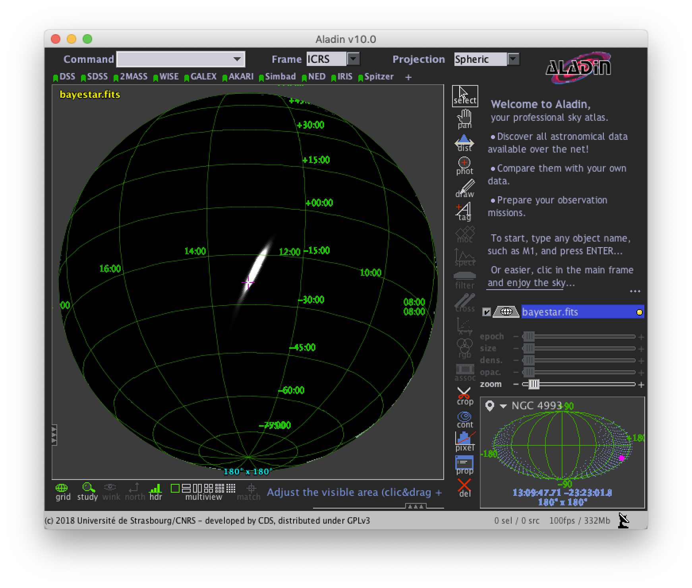

Technical Reference
===================

Public LIGO/Virgo alerts are distributed using the Gamma-ray Coordinates
Network (GCN_). The machine-readable alerts are called GCN Notices.

GCN Notices are available over several different protocols and in several
different formats. LIGO/Virgo strongly recommends using the VOEvent Transport
Protocol (VTP_) to receive notices in VOEvent_ XML format because it is
anonymous, configuration-free, and easy to parse.

Prerequisites
-------------

In order to run this sample code, you will need Python >= 3.5 on a Unix-like
operating system (Linux or macOS) and a few third-party Python packages:

  * PyGCN_ for connecting to GCN (alternatives: comet_)
  * healpy_ for decoding HEALPix coordinates (alternatives: astropy-healpix_,
    the official C/C++/Fortran/Java/IDL HEALPix bindings for HEALPix_, DS9_,
    Aladin_)
  * astropy_ for astronomical coordinate transformations, observability, etc.
  * numpy_ and matplotlib_, popular math and plotting packages for Python

If you are on a Mac and use the MacPorts_ package manager, you can install all
of the above with the following command::

    $ sudo port install py37-gcn py37-healpy

Otherwise, the fastest way to install the dependencies is with pip_, a package
manager that comes with most Python distributions. To install these packages
with ``pip``, run the following command::

    $ pip install pygcn healpy

Imports
-------

Now we'll write a GCN handler script. First, some imports::

    import gcn
    import gcn.handlers
    import gcn.notice_types
    import healpy as hp
    import numpy as np

GCN Handler
-----------

Next, we'll write a GCN handler function that we want PyGCN to call every time
it receives a GCN notice. We :term:`decorate <decorator>` the handler with
``@gcn.handlers.include_notice_types`` to specify that we only want to process
certain GCN notice types (``LVC_PRELIMINARY``, ``LVC_INITIAL``, and
``LVC_UDPATE``).

Events come in two very general flavors: 'CBC' or compact binary coalescence
candidates detected by matched filtering, and generic 'Burst' candidates
detected by model-independent methods. Your handler can take different actions
based on this. The example below will handle only 'CBC' events.

.. important::
   Note that mock or 'test' observations are denoted by the ``role="test"``
   VOEvent attribute. Alerts resulting from real LIGO/Virgo science data will
   always have ``role="observation"``. The sample code below will respond
   **only** to 'test' events. When preparing for actual observations, you
   **must remember to switch to 'observation' events**.

The following basic handler function will parse out the URL of
the FITS file, download it, and extract the probability sky map::

    # Function to call every time a GCN is received.
    # Run only for notices of type
    # LVC_PRELIMINARY, LVC_INITIAL, or LVC_UPDATE.
    @gcn.handlers.include_notice_types(
        gcn.notice_types.LVC_PRELIMINARY,
        gcn.notice_types.LVC_INITIAL,
        gcn.notice_types.LVC_UPDATE)
    def process_gcn(payload, root):
        # Print the alert
        print('Got VOEvent:')
        print(payload)

        # Respond only to 'test' events.
        # VERY IMPORTANT! Replace with the following code
        # to respond to only real 'observation' events.
        # if root.attrib['role'] != 'observation':
        #    return
        if root.attrib['role'] != 'test':
            return

        # Respond only to 'CBC' events. Change 'CBC' to "Burst'
        # to respond to only unmodeled burst events.
        if root.find(".//Param[@name='Group']").attrib['value'] != 'CBC':
            return

        # Read out integer notice type (note: not doing anythin with this right now)
        notice_type = int(root.find(".//Param[@name='Packet_Type']").attrib['value'])

        # Read sky map
        skymap, header = get_skymap(root)

The ``get_skymap`` function will be defined in the next section.

Download sky map
----------------

Now we will define the function ``get_skymap`` get the sky map URL from the
VOEvent, download it, and read it with Healpy.

.. note::
   We do not have to explicitly download the FITS file because the
   :func:`hp.read_map() <healpy.fitsfunc.read_map>` function works with either
   URLs or filenames. However, you could download and save the FITS file in
   order to save it locally using :func:`astropy.utils.data.download_file`,
   :func:`requests.get`, :func:`urllib.request.urlopen`, or even curl_.

::

    def get_skymap(root):
        """
        Look up URL of sky map in VOEvent XML document,
        download sky map, and parse FITS file.
        """
        # Read out URL of sky map.
        # This will be something like
        # https://gracedb.ligo.org/api/events/M131141/files/bayestar.fits.gz
        skymap_url = root.find(
            ".//Param[@name='skymap_fits']").attrib['value']

        # Read the sky map.
        # Note: this works on filenames or URLs.
        # The `h=True` argument instructs Healpy to also return the metadata
        # from the FITS header, and the `verbose=False` argument suppresses
        # printing of some diagnostic information.
        skymap, header = hp.read_map(skymap_url, h=True, verbose=False)

        # Done!
        return skymap, header

Listen for GCNs
---------------

Finally, we will start the VOEvent client to listen for GCNs using the
`gcn.listen` function. By default, this will connect to the anonymous, public
GCN server. You just need to tell `gcn.listen` what function to call whenever
it receives an GCN; in this example, that is the `process_gcn` handler that we
defined above.

.. note::
   `gcn.listen` will try to automatically reconnect if the network connection
   is ever broken.

::

    # Listen for GCNs until the program is interrupted
    # (killed or interrupted with control-C).
    gcn.listen(handler=process_gcn)

Working with probability sky maps
---------------------------------

Let's take a look at what is inside one of the LIGO/Virgo probability sky maps.
They are FITS image files and can be manipulated and viewed with many
commonplace FITS tools. However, they are a little unusual in two regards.
First, since they are all-sky images, they are stored in the HEALPix
projection, a format that is used for Planck_ all-sky CMB maps and by Aladin
for hierarchical, progressively refined, all-sky survey images (HiPS_)].
Second, the value stored at each pixel is the probability that the
gravitational-wave source is within that pixel.

.. image:: https://healpix.jpl.nasa.gov/images/healpixGridRefinement.jpg
   :alt: HEALPix projection

Let's download an example FITS file with curl_::

    $ curl -O https://emfollow.docs.ligo.org/userguide/_static/bayestar.fits.gz

We can look at the metadata inside the FITS file by printing its header with
tools like funhead_ from Funtools_, imhead_ from WCSTools_, or
:mod:`~astropy.io.fits.scripts.fitsheader` from astropy_::

    $ fitsheader bayestar.fits.gz
    # HDU 0 in bayestar.fits.gz:
    SIMPLE  =                    T / conforms to FITS standard
    BITPIX  =                    8 / array data type
    NAXIS   =                    0 / number of array dimensions
    EXTEND  =                    T

    # HDU 1 in bayestar.fits.gz:
    XTENSION= 'BINTABLE'           / binary table extension
    BITPIX  =                    8 / array data type
    NAXIS   =                    2 / number of array dimensions
    NAXIS1  =                   32 / length of dimension 1
    NAXIS2  =               786432 / length of dimension 2
    PCOUNT  =                    0 / number of group parameters
    GCOUNT  =                    1 / number of groups
    TFIELDS =                    4 / number of table fields
    TTYPE1  = 'PROB    '
    TFORM1  = 'D       '
    TUNIT1  = 'pix-1   '
    TTYPE2  = 'DISTMU  '
    TFORM2  = 'D       '
    TUNIT2  = 'Mpc     '
    TTYPE3  = 'DISTSIGMA'
    TFORM3  = 'D       '
    TUNIT3  = 'Mpc     '
    TTYPE4  = 'DISTNORM'
    TFORM4  = 'D       '
    TUNIT4  = 'Mpc-2   '
    PIXTYPE = 'HEALPIX '           / HEALPIX pixelisation
    ORDERING= 'NESTED  '           / Pixel ordering scheme: RING, NESTED, or NUNIQ
    COORDSYS= 'C       '           / Ecliptic, Galactic or Celestial (equatorial)
    NSIDE   =                  256 / Resolution parameter of HEALPIX
    INDXSCHM= 'IMPLICIT'           / Indexing: IMPLICIT or EXPLICIT
    OBJECT  = 'M2052   '           / Unique identifier for this event
    REFERENC= 'https://gracedb-playground.ligo.org/events/M2052' / URL of this event
    INSTRUME= 'H1,L1   '           / Instruments that triggered this event
    DATE-OBS= '2018-11-01T22:22:46.654438' / UTC date of the observation
    MJD-OBS =    58423.93248442614 / modified Julian date of the observation
    DATE    = '2018-11-01T22:34:37.000000' / UTC date of file creation
    CREATOR = 'BAYESTAR'           / Program that created this file
    ORIGIN  = 'LIGO/Virgo'         / Organization responsible for this FITS file
    RUNTIME =                 11.0 / Runtime in seconds of the CREATOR program
    DISTMEAN=    141.1453950128411 / Posterior mean distance (Mpc)
    DISTSTD =    39.09548411497191 / Posterior standard deviation of distance (Mpc)
    LOGBCI  =    7.793862946657789 / Log Bayes factor: coherent vs. incoherent
    LOGBSN  =    47.28194676827084 / Log Bayes factor: signal vs. noise
    VCSVERS = 'ligo.skymap 0.0.17' / Software version
    VCSREV  = 'cb59e5fd04d41c5181ae9e41fe59de232877ddd2' / Software revision (Git)
    DATE-BLD= '2018-10-24T20:50:55' / Software build date
    HISTORY
    HISTORY Generated by calling the following Python function:
    HISTORY ligo.skymap.bayestar.localize(event=..., waveform='o2-uberbank', f_low=3
    HISTORY 0.0, min_distance=None, max_distance=None, prior_distance_power=None, co
    HISTORY smology=False, mcmc=False, chain_dump=None, enable_snr_series=True, f_hi
    HISTORY gh_truncate=0.95)
    HISTORY
    HISTORY This was the command line that started the program:
    HISTORY gwcelery worker -l info -n gwcelery-openmp-worker -Q openmp -c 1

There are several useful pieces of information here:

  * ``COORDSYS=C``, telling you that the HEALPix projection is in the Celestial
    (equatorial, ICRS) frame, as all LIGO/Virgo probability sky maps will be.
  * ``OBJECT``, the unique LIGO/Virgo identifier for the event.
  * ``REFERENC``, a link to the candidate page in the GraceDb_
    gravitational-wave candidate event database.
  * ``INSTRUME``, a list of gravitational-wave sites that triggered on the
    event: `H1` for LIGO Hanford, `L1` for LIGO Livingston, and `V1` for Virgo.
  * ``DATE-OBS``, the UTC time of the event. In the case of a compact binary
    coalescence candidate, this is the time that the signal from the merger
    passed through the geocenter.
  * ``MJD-OBS``, same as `DATE-OBS`, but given as a modified Julian day.

You can view the sky map in many common FITS image viewers such as
Aladin_:

or DS9_ (although DS9 shows HEALPix sky maps in an unusual orientation; see
Figure 4 of `Calabretta & Roukema 2007`_ for more information.

Now, let's go through some examples of manipulating HEALPix sky maps
programmatically. The HEALPix_ project provides official libraries for many
languages, including C, C++, Fortran, IDL, and Java. However, since this is a
Python tutorial, we are going to demonstrate how to manipulate HEALPix maps
with the official Python library, healpy_.

First, if you have not already downloaded an example sky map, you can do so now
by having Python call `curl` on the command line::

    # Download sky map
    import subprocess
    subprocess.check_call([
        'curl', '-O',
        'https://emfollow.docs.ligo.org/userguide/_static/bayestar.fits.gz'])

.. _Aladin: https://aladin.u-strasbg.fr
.. _astropy-healpix: https://pypi.org/project/astropy-healpix/
.. _astropy: https://pypi.org/project/astropy/
.. _comet: https://pypi.org/project/Comet/
.. _curl: https://curl.haxx.se
.. _DS9: http://ds9.si.edu
.. _funhead: https://linux.die.net/man/1/funhead
.. _Funtools: https://github.com/ericmandel/funtools
.. _GCN: http://gcn.gsfc.nasa.gov/
.. _GraceDb: https://gracedb.ligo.org
.. _HEALPix: https://healpix.sourceforge.io
.. _healpy: https://pypi.org/project/healpy/
.. _HiPS: https://aladin.u-strasbg.fr/hips/
.. _imhead: https://linux.die.net/man/1/imhead
.. _MacPorts: https://www.macports.org
.. _matplotlib: https://pypi.org/project/matplotlib/
.. _numpy: https://pypi.org/project/numpy/
.. _pip: https://pip.pypa.io
.. _Planck: https://www.esa.int/planck
.. _PyGCN: https://pypi.org/project/pygcn/
.. _VOEvent: http://www.ivoa.net/documents/VOEvent/
.. _VTP: http://www.ivoa.net/documents/Notes/VOEventTransport/
.. _WCSTools: http://tdc-www.harvard.edu/wcstools/
.. _`Calabretta & Roukema 2007`: https://adsabs.harvard.edu/abs/2007MNRAS.381..865C
